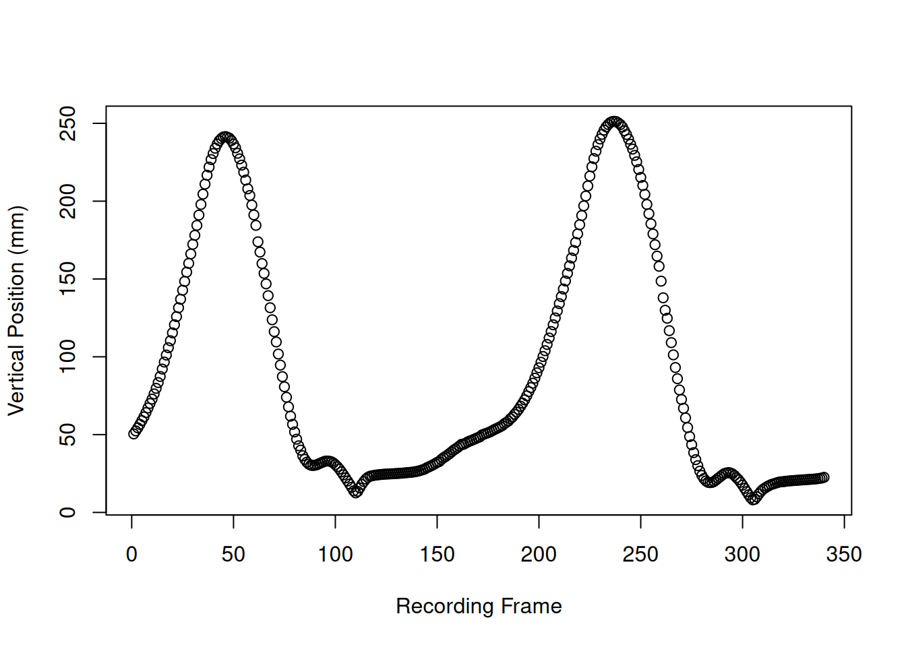
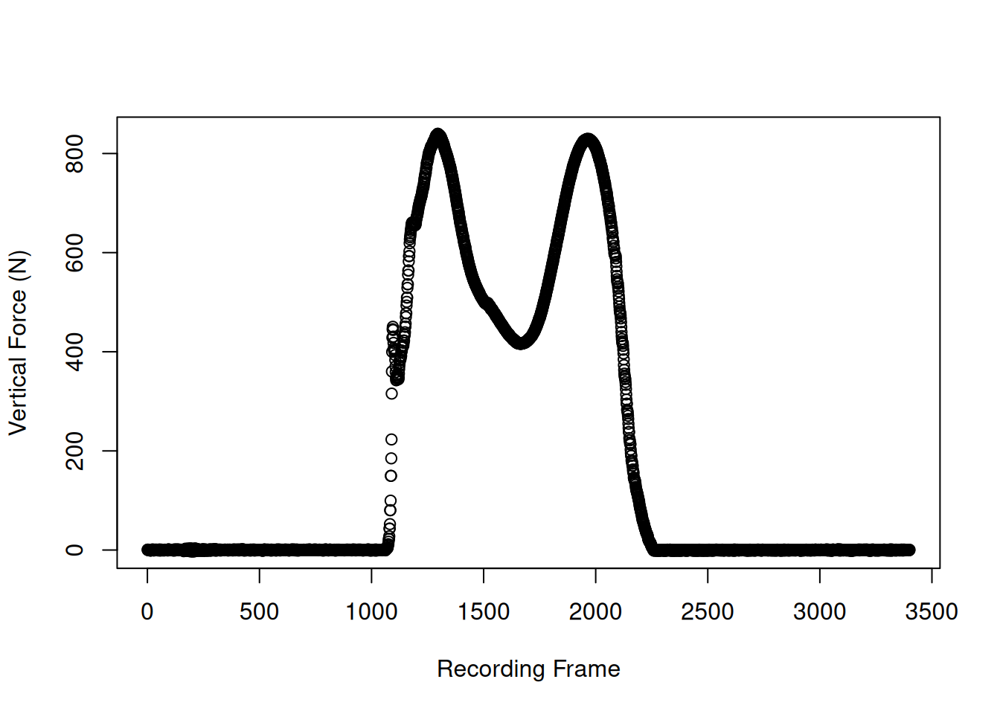

# Getting Started

## What are C3D files?

C3D is a file format to store biomechanical data. Most motion capture
systems output C3D files, making it the standard data format for motion
analysis. All C3D files are structured in a similar way: They contain a
header that describes the file’s structure, a parameter section with
useful meta data (e.g., labels, measurement units, frame rate, …), and a
data section with the point data (coordinates of the objects) and
additional analog data (e.g., recordings from electromyography or force
platforms). You can find more details about the C3D format on its
[Website](https://www.c3d.org/index.html) and in the [C3D User
Guide](https://www.c3d.org/docs/C3D_User_Guide.pdf).

## Why use the c3dr package for R?

Different programs for working with C3D files exist, but free
open-source solutions that enable reproducible analysis are rare.
Currently the best solution is the
[EZC3D](https://github.com/pyomeca/ezc3d) library, which has bindings
for Matlab, Python, and Octave. However, R, a popular programming
language for data science, previously did not support C3D files. By
using the EZC3D C++ library, the `c3dr` package for R now provides a
possibility to work with C3D data in the R programming environment.

## Install the c3dr package

The `c3dr` package is currently available from CRAN and R-Universe. For
installation, simply use the following code:

``` r

install.packages("c3dr")

# Alternative for the development version:
# install.packages("c3dr", repos = "https://ropensci.r-universe.dev")
```

## Read C3D files with c3dr

To import a c3d file simply run the
[`c3d_read()`](https://docs.ropensci.org/c3dr/reference/c3d_read.md)
function with the absolute or relative file path as argument. We here
use an example file provided with the packages, that can be called using
[`c3d_example()`](https://docs.ropensci.org/c3dr/reference/c3d_example.md).
The example file is a short recording of human walking, with force
platforms measuring the ground impact of two steps. The measurements
were performed using a Qualisys motion capture system. You can view a
video of the
[recording](https://github.com/ropensci/c3dr/blob/main/video/index.md).

``` r

library(c3dr)
# this example uses an internal example file
filepath <- c3d_example()

# import C3D file
d <- c3d_read(filepath)
d
#> A c3d object with
#> - 55 data points and 340 frames
#> - 1.70 s measurement duration (200 fps)
#> - 69 analog channels (2000 fps)
#> - 2 force platforms with 3400 frames
```

## Data structure of C3D objects in R

The [`c3d_read()`](https://docs.ropensci.org/c3dr/reference/c3d_read.md)
function returns a c3d object, which is a list with different
components.

``` r

str(d, max.level = 1)
#> List of 6
#>  $ header       :List of 6
#>  $ parameters   :List of 7
#>  $ data         :List of 340
#>  $ residuals    : num [1:340, 1:55] 1280 1280 1280 1280 1280 ...
#>  $ analog       :List of 340
#>  $ forceplatform:List of 2
#>  - attr(*, "class")= chr [1:2] "c3d" "list"
```

### Header

The header contains basic information about the number of frames
(`nframes`), the number of data points (`npoints`), the number of analog
channels (`nanalogs`), the number of analog frames per data frame
(`analogperframe`), the frame rate in Hz (`framerate`) and the number of
saved events (`nevents`).

``` r

d$header
#> $nframes
#> [1] 340
#> 
#> $npoints
#> [1] 55
#> 
#> $nanalogs
#> [1] 69
#> 
#> $analogperframe
#> [1] 10
#> 
#> $framerate
#> [1] 200
#> 
#> $nevents
#> [1] 0
```

### Parameters

The parameters are all the meta data saved in the C3D file. Parameters
in C3D files are organized in groups, and these are preserved during
import with
[`c3d_read()`](https://docs.ropensci.org/c3dr/reference/c3d_read.md).
The parameter section of a c3d object is therefore a list of lists. To
access a single parameter, you first need to access its group and then
the parameter. For example the `SOFTWARE` parameter is part of the
`MANUFACTURER` group. To retrieve the parameter value from a c3d object
named `f` you need to call `f$parameters$MANUFACTURER$SOFTWARE`.

``` r

str(d$parameters, max.level = 1)
#> List of 7
#>  $ POINT         :List of 12
#>  $ ANALOG        :List of 10
#>  $ SEG           :List of 5
#>  $ MANUFACTURER  :List of 3
#>  $ FORCE_PLATFORM:List of 8
#>  $ EVENT         :List of 3
#>  $ PROCESSING    :List of 4

# retrieve SOFTWARE parameter from MANUFACTURER group
d$parameters$MANUFACTURER$SOFTWARE
#> [1] "Qualisys Track Manager"
```

### Point data

c3d objects in R save point data (the three-dimensional position of
objects over time) as a nested list, with the two levels frame and
point. For example for a c3d object named `f`, `f$data[[1]][[2]]`
returns a three-coordinate vector of the first frame for the second data
point.

Usually it is much more convenient to work with the point data in a
table (i.e., a data frame). This conversion happens with
[`c3d_data()`](https://docs.ropensci.org/c3dr/reference/c3d_data.md),
see [Section 6](#sec-point).

``` r

# read the coordinates of the first frame for the second data point
d$data[[1]][[2]]
#> [1] -398.1731  237.0688  872.8574
```

### Analog data

Analog data in c3d objects is saved as a nested list. The sampling
frequency of analog data is a multiplier of the point frame rate. For
example, point data can be collected in 240 Hz, whereas analog data in
sampled at 960 Hz. Therefore each frame of point data can correspond to
multiple subframes of analog data. In `c3dr` analog data is saved as a
list of matrices, with each list entry corresponding to a single point
frame. The row of each frame matrix corresponds to a subframe, with the
column corresponding to a analog channel. For example for a c3d object
named `f`, `f$analog[[2]][3,1]` returns the value of the first analog
channel for the third subframe of the second point frame.

Often it is more convenient to work with the analog data in a table
(i.e., a data.frame). This conversion happens with
[`c3d_analog()`](https://docs.ropensci.org/c3dr/reference/c3d_analog.md),
see [Section 7](#sec-analog).

``` r

d$analog[[2]][3, 1]
#> [1] -0.3131914

# read the values of the first five analog channels for the first point frame
# The sampling frequency is ten times that of the point data, resulting in
# ten subframes
d$analog[[1]][, 1:5]
#>             [,1]       [,2]       [,3]       [,4]       [,5]
#>  [1,] -0.3096819 -0.2837415 -0.2492561 -0.2404060 -0.2407112
#>  [2,] -0.3087664 -0.2861829 -0.2495613 -0.2401009 -0.2402534
#>  [3,] -0.3057146 -0.2837415 -0.2494087 -0.2401009 -0.2407112
#>  [4,] -0.3078508 -0.2858777 -0.2484932 -0.2388802 -0.2410164
#>  [5,] -0.3109026 -0.2854199 -0.2507820 -0.2396431 -0.2416267
#>  [6,] -0.3109026 -0.2858777 -0.2520027 -0.2390327 -0.2422371
#>  [7,] -0.3147173 -0.2866406 -0.2532234 -0.2396431 -0.2426949
#>  [8,] -0.3102922 -0.2875562 -0.2536812 -0.2396431 -0.2434578
#>  [9,] -0.3113604 -0.2889295 -0.2567329 -0.2394905 -0.2440681
#> [10,] -0.3119707 -0.2895398 -0.2552071 -0.2413216 -0.2452888
```

### Force platform data

c3d files can store data from force platforms. When importing with
[`c3d_read()`](https://docs.ropensci.org/c3dr/reference/c3d_read.md),
the force platform data is stored as a list, with each element of the
list corresponding to one force platform.

``` r

# this example file has data from two force platforms
str(d$forceplatform)
#> List of 2
#>  $ :List of 5
#>   ..$ forces : num [1:3400, 1:3] 0.1399 0.1399 0.0933 0.0466 0.0466 ...
#>   ..$ moments: num [1:3400, 1:3] 20.9 -77.6 -12.5 71.4 -10.3 ...
#>   ..$ cop    : num [1:3400, 1:3] 229 NaN 446 NaN 327 ...
#>   ..$ tz     : num [1:3400, 1:3] 0 NaN 0 NaN 0 0 0 NaN 0 0 ...
#>   ..$ meta   :List of 7
#>   .. ..$ frames   : num 3400
#>   .. ..$ funit    : chr "N"
#>   .. ..$ munit    : chr "Nmm"
#>   .. ..$ punit    : chr "mm"
#>   .. ..$ calmatrix: num [1:6, 1:6] 0 0 0 0 0 0 0 0 0 0 ...
#>   .. ..$ corners  : num [1:4, 1:3] 508 508 0 0 464 ...
#>   .. ..$ origin   : num [1, 1:3] 1.524 -0.762 -34.036
#>  $ :List of 5
#>   ..$ forces : num [1:3400, 1:3] 0.0463 -0.1853 0.2317 -0.139 0 ...
#>   ..$ moments: num [1:3400, 1:3] 49.4 -63.5 25.4 70.3 89.5 ...
#>   ..$ cop    : num [1:3400, 1:3] 897 NaN 827 854 868 ...
#>   ..$ tz     : num [1:3400, 1:3] 7.11e-15 NaN 0.00 0.00 0.00 ...
#>   ..$ meta   :List of 7
#>   .. ..$ frames   : num 3400
#>   .. ..$ funit    : chr "N"
#>   .. ..$ munit    : chr "Nmm"
#>   .. ..$ punit    : chr "mm"
#>   .. ..$ calmatrix: num [1:6, 1:6] 0 0 0 0 0 0 0 0 0 0 ...
#>   .. ..$ corners  : num [1:4, 1:3] 1017 1017 509 509 464 ...
#>   .. ..$ origin   : num [1, 1:3] 1.02 0 -36.32
```

Each force platform has data on forces, moments, the center of pressure,
and the moments at the center of pressure, as well as meta data. The
force data is stored as a matrix, where each row corresponds to one
recording frame of the platform and each column to one dimension (x, y,
z).

``` r

# view for the first force platform the force data for the first five frames
d$forceplatform[[1]]$forces[1:5, ]
#>            [,1]       [,2]       [,3]
#> [1,] 0.13992119  0.0461483 -0.1835251
#> [2,] 0.13992119 -0.0461483  0.0000000
#> [3,] 0.09328079  0.1845932 -0.1835251
#> [4,] 0.04664040 -0.1384449  0.0000000
#> [5,] 0.04664040 -0.2768898  0.5505753
```

## Work with C3D point data

To return a table of the imported point data of a c3d object, run the
[`c3d_data()`](https://docs.ropensci.org/c3dr/reference/c3d_data.md)
function.

``` r

p <- c3d_data(d)

p[1:5, 1:5]
#>     L_IAS_x  L_IAS_y  L_IAS_z   L_IPS_x  L_IPS_y
#> 1 -220.1226 306.4248 846.3361 -398.1731 237.0688
#> 2 -212.4696 306.5356 844.6985 -390.7831 237.8691
#> 3 -204.8696 306.6555 843.2342 -383.1857 238.6758
#> 4 -197.1952 306.8035 841.6127 -375.7068 239.5434
#> 5 -189.6655 307.0628 840.1692 -368.1680 240.4141
```

The table of point data has three different structures available, that
can be selected by the `format` argument in the
[`c3d_data()`](https://docs.ropensci.org/c3dr/reference/c3d_data.md)
call:

- The `wide` format (default) has one column per point coordinate and
  one row per frame.
- The `long` format has one column per point and three rows (x, y, z)
  per frame.
- The `longest` format has one column for data, and three rows (x, y, z)
  per each frame and point.

``` r

p_long <- c3d_data(d, format = "long")
p_long[1:5, 1:5]
#>   frame type     L_IAS     L_IPS     R_IPS
#> 1     1    x -220.1226 -398.1731 -392.8751
#> 2     1    y  306.4248  237.0688  146.2103
#> 3     1    z  846.3361  872.8574  880.3161
#> 4     2    x -212.4696 -390.7831 -385.6659
#> 5     2    y  306.5356  237.8691  147.1048

p_longest <- c3d_data(d, format = "longest")
p_longest[1:5, ]
#>   frame type point     value
#> 1     1    x L_IAS -220.1226
#> 2     1    y L_IAS  306.4248
#> 3     1    z L_IAS  846.3361
#> 4     1    x L_IPS -398.1731
#> 5     1    y L_IPS  237.0688
```

## Work with C3D analog data

To return a table of the imported analog data of a c3d file, use the
[`c3d_analog()`](https://docs.ropensci.org/c3dr/reference/c3d_analog.md)
function.

``` r

a <- c3d_analog(d)
a[1:5, 41:46]
#>           EMG 1        EMG 2        EMG 3        EMG 4        EMG 5
#> 1 -3.601184e-05 7.324442e-06 1.647999e-05 1.849422e-04 3.112888e-05
#> 2  4.638813e-05 8.697775e-06 1.533555e-05 1.203955e-04 2.861110e-05
#> 3  1.280251e-04 1.007111e-05 1.449629e-05 7.187109e-05 2.838221e-05
#> 4  1.841029e-04 1.190222e-05 1.350444e-05 4.325999e-05 3.028962e-05
#> 5  1.898251e-04 1.464888e-05 1.190222e-05 3.845332e-05 3.418073e-05
#>          EMG 6
#> 1 1.434370e-05
#> 2 1.480148e-05
#> 3 1.586963e-05
#> 4 1.670889e-05
#> 5 1.647999e-05
```

## Further analysis of imported data

The ‘c3dr’ package is used to import and process motion capture data.
Further analyses and visualizations can be performed in R, but this is
outside the scope of the package. For a simple demonstration of
visualising the imported data in R, see the following examples.

``` r

# plot the z-coordinate (the vertical position) of the right heel
plot(p$R_FCC_z, xlab = "Recording Frame", ylab = "Vertical Position (mm)")
```



``` r


# plot the vertical force vector of the second force platform
plot(
  d$forceplatform[[2]]$forces[, 3],
  xlab = "Recording Frame",
  ylab = "Vertical Force (N)"
)
```



## Write C3D files with c3dr

You can write an existing c3d object in R to a c3d file with the
[`c3d_write()`](https://docs.ropensci.org/c3dr/reference/c3d_write.md)
function:

``` r

c3d_write(d, "newfile.c3d")
```

To make modifications to the point or analog data before writing the
file, you can use
[`c3d_setdata()`](https://docs.ropensci.org/c3dr/reference/c3d_setdata.md).
This function allows you to update a c3d object with modified data,
e.g., to remove, add, rename or convert frames, points and analog
channels.

``` r

# E.g. remove the last point from the point data
full_data <- c3d_data(d, format = "long")
cut_data <- full_data[, -57]

# update the data and write to new file
new_object <- c3d_setdata(d, newdata = cut_data)
c3d_write(new_object, "modified.c3d")
```
